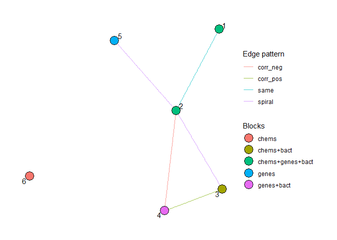
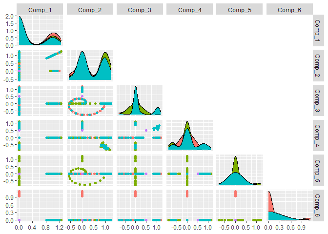
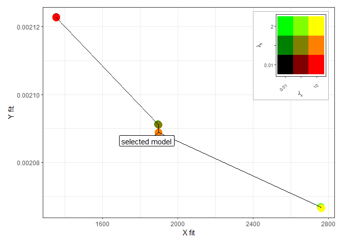
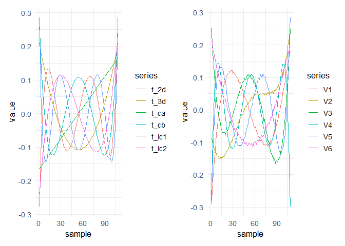
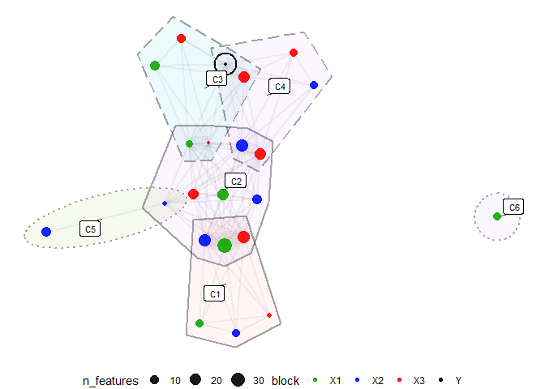

PESCAR tutorial simulation
================
Fred White
2026-05-02

- [Overview](#overview)
- [Load packages](#load-packages)
- [Simulate data](#simulate-data)
- [Inspect simulated loadings](#inspect-simulated-loadings)
- [Model options](#model-options)
- [Optional sampled subset](#optional-sampled-subset)
- [Fit PESCAR](#fit-pescar)
- [Select a model from the grid](#select-a-model-from-the-grid)
- [Pareto front plot](#pareto-front-plot)
- [Rotate selected model](#rotate-selected-model)
- [Label components](#label-components)
- [Loading profiles](#loading-profiles)
- [Compare true and estimated
  scores](#compare-true-and-estimated-scores)
- [Threshold the loading matrix and plot
  hypergraph](#threshold-the-loading-matrix-and-plot-hypergraph)
- [Final figure collation](#final-figure-collation)
- [Summary](#summary)

# Overview

This tutorial demonstrates the basic use of `PESCAR` on simulated data.

The example follows five steps:

1.  simulate three predictor blocks with known Common, Local and
    Distinct component structure;
2.  simulate a response variable related to selected components;
3.  fit PESCAR over a small grid of `lambda_x` and `lambda_y` values;
4.  select a model from the Pareto front;
5.  inspect the selected model with loading profiles, variance explained
    and component relationship plots.

# Load packages

``` r
library(scales)
library(ggpubr)
library(extrafont)
library(GGally)
library(Matrix)
library(MASS)
library(pracma)    # - WARNING - conflicting ones() function with RpESCA
library(RpESCA)
library(tidygraph)
library(ggraph)
library(igraph)
library(tidyr)
library(hrbrthemes)
library(reshape2)

library(PESCAR)
```

# Simulate data

We begin by simulating the data blocks and corresponding response. The
simulated data contain three predictor blocks and one response (vector).

The latent structure is specified through six components:

- two Common components across all three predictor blocks;
- two Local components across two predictor blocks;
- two Distinct components one in X1 and one in X2.

``` r
Yweights <- c(0, 0, 0.5, 0.5)

K <- 6

block_names <- c("chems", "genes", "bact")

# For each component r = 1..6, which blocks it belongs to:
blocks_list <- list(
  c("chems","genes","bact"),   # comp 1: C
  c("chems","genes","bact"),   # comp 2: C
  c("chems","bact"),           # comp 3: L (chems + bact)
  c("genes","bact"),           # comp 4: L (genes + bact)
  c("genes"),                  # comp 5: D (genes-only)
  c("chems")                   # comp 6: D (chems-only)
)


generate_component_graph_constrained <- function(blocks_list,
                                                 edge_prob = 0.4,
                                                 seed = NULL,
                                                 directed = FALSE) {
  if (!is.null(seed)) set.seed(seed)

  K <- length(blocks_list)
  stopifnot(K >= 1)

  # helper: do two nodes share at least 1 block?
  shares_block <- function(i, j) length(intersect(blocks_list[[i]], blocks_list[[j]])) > 0L

  # all possible pairs (upper triangle)
  pairs <- combn(K, 2)
  keep  <- apply(pairs, 2, function(idx) shares_block(idx[1], idx[2]))

  allowed_pairs <- pairs[, keep, drop = FALSE]

  g <- make_empty_graph(n = K, directed = directed)
  V(g)$name   <- as.character(seq_len(K))
  V(g)$blocks <- blocks_list

  # sample edges only from allowed pairs
  if (ncol(allowed_pairs) > 0) {
    take <- runif(ncol(allowed_pairs)) < edge_prob
    chosen <- allowed_pairs[, take, drop = FALSE]

    if (ncol(chosen) > 0) {
      g <- add_edges(g, as.vector(chosen))
    }
  }

  g
}

g <- generate_component_graph_constrained(
  blocks_list = blocks_list,
  edge_prob   = 0.4,
  seed        = 104
)


get_CLD_type <- function(blocks_vec, all_blocks) {
  k <- length(blocks_vec)
  if (k == length(all_blocks)) return("C")
  if (k == 1L)                 return("D")
  if (k > 1L)                  return("L")
  return("None")  
}

V(g)$type <- vapply(
  V(g)$blocks,
  get_CLD_type,
  character(1),
  all_blocks = block_names
)

E(g)$pattern <- sample(c("circle","opposite","corr_pos","corr_neg","spiral","same"),size = length(E(g)), replace = TRUE)

cg1 <- g

cg1_tbl <- as_tbl_graph(cg1) %>%
  mutate(
    # turn list-column "blocks" into a single label per node
    block_group = sapply(blocks, paste, collapse = "+"),
    type        = factor(type)
  ) %>%
  activate(edges) %>%
  mutate(pattern = factor(pattern))

ggraph(cg1_tbl, layout = "fr") +
  geom_edge_link(aes(colour = pattern), alpha = 0.7) +
  geom_node_point(aes(fill = block_group), size = 6, shape = 21, colour = "black") +
  geom_node_text(aes(label = name), repel = TRUE) +
  scale_edge_colour_discrete(name = "Edge pattern") +
  scale_fill_discrete(name = "Blocks") +
  theme_graph()
```

<!-- -->

``` r

simulation = PESCAR:::dataSimWrapper(Yweights = Yweights,
                              componentWeights = list(c(0.5,0.5,0.5,0.5, 0.5),
                                                      c(0.5,0.5,0.5,0.5),
                                                      c(0.5,0.5,0.5, 0.5)),
                              Ynoise_sd = 0.01, error_weights = c(0.2,0.2,0.2),
                              numFeatures_chems = (c(10,5,10,5,10,5,10)),
                              numFeatures_bact = (c(0,0,10,5,10,0,0)),
                              numFeatures_genes = (c(10,5,10,5,10,0,0)),
                              seed = 123,
                              polydemo = T,
                              component_graph = g,
                              topology_pure_frac = 0.3)

if(length(Yweights < 6)){
  Yweights <- c(Yweights, rep(0, 6-length(Yweights)))
}

Data = simulation[[1]]
y = simulation[[3]]
Data[[length(Data)+1]] <- y # add y as the fourth block

colnames(Data[[4]]) <- paste0("Y_", 1:ncol(y))

names(Data) <- c("Metabolite","Gene","Bacteria","Y")
names(Data) <- c("X1","X2","X3","Y")
```

# Inspect simulated loadings

The pairwise plot below shows the simulated loading structure. Points
are coloured by block.

``` r
library(ggplotify)
library(patchwork)

pdf <- cbind.data.frame("ID" = rep(names(Data), lapply(Data,ncol)), rbind(simulation[[2]], Yweights))

B_sim_pairs <- GGally::ggpairs(
  pdf,
  columns = 2:ncol(pdf),
  upper = list(continuous = "blank"),
  mapping = ggplot2::aes(colour = ID)
)
B_sim_pairs
```

<!-- -->

# Model options

Estimate block weights and sets the main PESCAR options.

``` r
dataTypes <- "GGG"

# concave function and its hyper-parameter
fun_concave <- 'gdp'; gamma <- 1;
penalty = 'L2' # concave L2 norm penalty

# no alpha estimation for y as cannot perform svd on 1 variable
alpha_result = PESCAR:::pesca_estimate_alphas(datasets=Data[1:3], numComponents=2:15, CVfolds=3)
alpha_est = alpha_result[[1]]
roels_alphas_stds = alpha_result[[2]]
R_selected_list = alpha_result[[3]]
cvErrors_list = alpha_result[[4]]

opts <- PESCAR:::generate_options(gamma = gamma, alpha_est = alpha_est)
opts$maxit <- 1000
opts$tol_obj <- 1e-6

dataTypes <- "GGGG"
opts$alphas[4] <- mean(opts$alphas)
```

# Optional sampled subset

The following code samples observations for later prediction-oriented
checks. Although this is not used here.

``` r
set.seed(129)
inds <- sample(nrow(Data[[1]]), 60)
inds <- inds[order(inds)]

i <- NULL
newdata <- list()
for(i in 1:3){
  newdata[[i]] <- Data[[i]][inds,]
}

y_samp <- Data[[4]][inds,]

spikes_from_sim <- function(simulation){
  #get spikes from sim

  yWeights <- simulation[[4]]
  loadings <- simulation[[2]]

  yWeights <- c(yWeights,rep(0,ncol(loadings) - length(yWeights)))

  cands <- loadings %*% yWeights

  cands <- cands[order(abs(cands[,1]), decreasing = T),]

  spikes <- cands[which(cands != 0)]
  return(spikes)
}
```

# Fit PESCAR

The grid search is deliberately small so that the tutorial can be
rendered reasonably quickly - for real data this might need to be larger
in order to find the preferred parameters.

``` r
opts$R <- 6

opts$rand_start <- "PLS"
newdata <- Data[1:3]
y_samp <- Data[[4]]

dataTypes = rep("G",3 )
opts <- PESCAR:::reset_A0_B0(opts)
alpha <- 0.75

nTries <- 3
nTriesy <- 3

lambdas_CVy <-  seq(from=0.01, to=2, length.out=nTriesy)
lambdas_CV <- seq(from=0.01, to=10, length.out=nTries)

if(alpha == 1){lambdas_CVy <- 0.1; opts$rand_start <- 0}

opts$save_history <- FALSE

model <- list (simulation[[5]],simulation[[2]],RpESCA::ones(nrow(simulation[[2]])))

result_CV <- PESCAR:::pESCA_CV_DEV(dataSets = newdata,
                            dataTypes = dataTypes,
                            y = y_samp,
                            lambdas_CV = lambdas_CV,
                            lambdas_CVy = lambdas_CVy,
                            penalty=penalty,
                            fun_concave=fun_concave,
                            alpha = alpha,
                            opts=opts,
                            ORTH_A = TRUE,
                            rstartseed = 31)
```

# Select a model from the grid

The model is selected from the Pareto front of the `X` and `Y` errors.
If there are multiple non-dominated points, the errors are min–max
scaled and the selected point is the closest to the utopia point.

``` r
index_min_cv <- which.min(result_CV$cvErrors_mat[,1])

d <- result_CV$cvErrors_mat
d <- cbind(d,c(1:nrow(d)))
D <- d[order(d[,1],d[,5],decreasing=FALSE),]
front <- D[which(!duplicated(cummin(D[,5]))),,drop = FALSE]

index_min_cv <- which.min(result_CV$cvErrors_mat[,1])

if(nrow(front) > 1){

  mat <- front[,c(1,5)]

  minv <- apply(mat, 2, min)
  rng  <- apply(mat, 2, function(z) diff(range(z)))
  Z    <- sweep(sweep(mat, 2, minv, "-"), 2, rng, "/")   # min–max to [0,1]

  d2   <- sqrt(rowSums(Z^2))          # Euclidean to (0,0)
  dInf <- apply(Z, 1, max)            # Chebyshev to (0,0)

  best_L2   <- which.min(d2)
  best_LInf <- which.min(dInf)

  best_L2; best_LInf
  mat[best_L2, ]; mat[best_LInf, ]

  index_min_cv <- front[best_L2,6]
}

lambda_vals <- rep(lambdas_CV, each = length(lambdas_CVy))
lambda_y_vals <- rep(lambdas_CVy, times = length(lambdas_CV))

lambdas <- rep(lambda_vals[index_min_cv], length(Data))
lambdas_y <- lambda_y_vals[index_min_cv]

PESCARmod <- result_CV$TrainModel[[index_min_cv]]
```

# Pareto front plot

Model selection tuning grid performance plot. Redness corresponds to
`lambda_x`, and greenness corresponds to `lambda_y`.

``` r
spikes <- names(spikes_from_sim(simulation))
GMR <- do.call(c,lapply(result_CV$TrainModel, function(nd) PESCAR:::pesca_FS(nd, newdata, y_samp, spikes, type = "PCR")[[1]]))

RV <- do.call(c,lapply(result_CV$TrainModel, function(modi){PESCAR:::RV_2(simulation[[5]], modi$outcome$A)}))

RV_y <- do.call(c,lapply(result_CV$TrainModel, function(modi){PESCAR:::RV_2(simulation[[5]][,c(3)], modi$outcome$A)}))
RV_X <- do.call(c,lapply(result_CV$TrainModel, function(modi){PESCAR:::RV_2(simulation[[5]][,-c(3)], modi$outcome$A)}))

lambda_y_vals_ <- lambda_y_vals

ux <- unique(lambda_vals)
uy <- unique(lambda_y_vals_)

r  <- (match(lambda_vals, ux) - 1) / max(length(ux) - 1, 1)
gr <- (match(lambda_y_vals_, uy) - 1) / max(length(uy) - 1, 1)
b  <- 0

col <- rgb(r, gr, b)

library(ggplot2)

result_CV_df <- data.frame(
  x = result_CV$cvErrors_mat[,1],
  y = result_CV$cvErrors_mat[,5],
  lambda_x = lambda_vals,
  lambda_y = lambda_y_vals,
  GMR = GMR,
  RV = RV,
  RV_X = RV_X,
  RV_y = RV_y,
  lambda_interaction = col
)

d <- result_CV_df
d <- cbind(d,c(1:nrow(d)))
D <- d[order(d[,1],d[,2],decreasing=FALSE),]
front_df <- D[which(!duplicated(cummin(D[,2]))),,drop = FALSE]

front_df <- data.frame(
  x = front_df[,1],
  y = front_df[,2]
)

library(ggplot2)
library(ggrepel)
library(patchwork)

legend_df <- unique(result_CV_df[, c("lambda_x", "lambda_y", "lambda_interaction")])

legend_df$lambda_x_f <- factor(legend_df$lambda_x, levels = unique(legend_df$lambda_x))
legend_df$lambda_y_f <- factor(legend_df$lambda_y, levels = unique(legend_df$lambda_y))

x_lev <- levels(legend_df$lambda_x_f)
y_lev <- levels(legend_df$lambda_y_f)

x_lab <- rep("", length(x_lev))
y_lab <- rep("", length(y_lev))

x_lab[c(1, length(x_lev))] <- x_lev[c(1, length(x_lev))]
y_lab[c(1, length(y_lev))] <- y_lev[c(1, length(y_lev))]

p_leg <- ggplot(legend_df, aes(x = lambda_x_f, y = lambda_y_f, fill = lambda_interaction)) +
  geom_tile() +
  scale_fill_identity() +
  scale_x_discrete(labels = x_lab) +
  scale_y_discrete(labels = y_lab) +
  labs(x = expression(lambda[x]), y = expression(lambda[y])) +
  theme_bw(base_size = 8) +
  theme(
    legend.position = "none",
    panel.grid = element_blank(),
    axis.text.x = element_text(angle = 45, vjust = 0.5, hjust = 1),
    axis.title = element_text(size = 8),
    plot.background = element_rect(fill = scales::alpha("white", 0.9), colour = "grey70")
  )

p_front_RV <- ggplot(result_CV_df, aes(x = x, y = y)) +
  geom_point(size = 5, aes(colour = I(lambda_interaction))) +
  geom_line(data = front_df, aes(x = x, y = y), color = "black") +
  ggrepel::geom_label_repel(
    data = result_CV_df[index_min_cv, , drop = FALSE],
    aes(label = "selected model"),
    inherit.aes = TRUE,
    fill = "white",
    label.size = 0.25,
    min.segment.length = 0
  ) +
  labs(x = "X fit", y = "Y fit") +
  theme_bw()

p_front <- p_front_RV +
  inset_element(
    p_leg,
    left   = 0.72,
    bottom = 0.56,
    right  = 0.98,
    top    = 0.98
  )

p_front
```

<!-- -->

# Rotate selected model

The selected model is rotated with varimax for easier inspection of
loading profiles.

``` r
B <- PESCARmod$outcome$B
A <- PESCARmod$outcome$A

vx <- varimax(B)$rotmat  # R x R, orthogonal
A_rot <- A %*% vx
B_rot <- B %*% vx

A <- A_rot
B <- B_rot

A <- A[,c(2,3,4,1,5,6)]
B <- B[,c(2,3,4,1,5,6)]

Coefs <- (solve(t(A)%*%A) %*% t(A) %*% y_samp)
```

# Label components

Components are labelled based on the pattern of non-zero block
contributions.

``` r
Sigma <- PESCARmod$outcome$varExpPCs

Sigma <- Sigma[,c(2,3,4,1,5,6)]

mat <- Sigma[-c(nrow(Sigma)),]

get_col_info <- function(col) {
  nz_idx <- which(col != 0)
  list(
    nz_count = length(nz_idx),
    pattern = paste(as.integer(col != 0), collapse = ""),
    row_str = paste(nz_idx, collapse = ",")
  )
}

col_info <- apply(mat, 2, get_col_info)
col_info_df <- do.call(rbind, lapply(seq_along(col_info), function(i) {
  data.frame(
    col_index = i,
    nz_count = col_info[[i]]$nz_count,
    pattern = col_info[[i]]$pattern,
    row_str = col_info[[i]]$row_str,
    stringsAsFactors = FALSE
  )
}))

col_info_df <- col_info_df[order(-col_info_df$nz_count, col_info_df$pattern), ]

G_counter <- 0
LC_counters <- list()
D_counters <- list()
col_info_df$group <- NA_character_

for (i in seq_len(nrow(col_info_df))) {
  row <- col_info_df[i, ]

  if (row$nz_count == nrow(mat)) {
    G_counter <- G_counter + 1
    col_info_df$group[i] <- paste0("C", G_counter)

  } else if (row$nz_count > 1) {
    key <- row$row_str
    if (!key %in% names(LC_counters)) {
      LC_counters[[key]] <- 1
    } else {
      LC_counters[[key]] <- LC_counters[[key]] + 1
    }
    col_info_df$group[i] <- paste0("L", key, "_", LC_counters[[key]])

  } else if (row$nz_count == 1) {
    key <- row$row_str
    if (!key %in% names(D_counters)) {
      D_counters[[key]] <- 1
    } else {
      D_counters[[key]] <- D_counters[[key]] + 1
    }
    col_info_df$group[i] <- paste0("D", key, "_", D_counters[[key]])
  }
}

col_info_df$Coef <- Coefs[col_info_df$col_index]

col_info_df$group[which(is.na(col_info_df$group))] <-
  paste0("None",c(1:length(col_info_df$group[which(is.na(col_info_df$group))])))
```

# Loading profiles

The following plot shows the loading profiles of features most
associated with the response direction.

``` r
B_y_ord <- B[,order(abs(Coefs), decreasing = T)]
A_y_ord <- A[,order(abs(Coefs), decreasing = T)]

Coefs_ord <- Coefs[order(abs(Coefs), decreasing = T)]/10

df <- cbind.data.frame(do.call(c,lapply(Data,colnames)) ,do.call(c,lapply(Data,colnames)),rbind(B,t(Coefs)))

colnames(df)[1:2] <- c("assay","Feature")

df$assay <- rep(names(Data), lapply(Data,ncol))

colnames(df)[-c(1,2)] <- paste0("PC",colnames(df)[-c(1,2)])

colours = c("X2" = "#0011FF", "X3" = "#FB0000", "X1" = "#11AA00", "Y" = "black")

data <- df

y1 <- Coefs

U <- df[]
rownames(U) <- U$Feature
U <- data.matrix(U[,-c(1,2)])

UTP <- (dot(t(U),y1)/dot(y1,y1))

UTP <- cbind.data.frame(names(UTP), UTP, U)

ranked <- as.data.frame(UTP[order(abs(UTP$UTP), decreasing = T),])

data$UTP   <- UTP[,2]

rank_UTP_matrix <- function(
  UTP_list,
  column = "UTP",
  data = NULL,
  n_top = NULL,
  quantile = 0.975,
  m_tail = 10,
  quantile_type = 8
) {

  process_one <- function(UTP_df) {

    UTP_split <- split(UTP_df, UTP_df$assay, drop = TRUE)

    ranked_list <- lapply(UTP_split, function(subdf) {

      vals <- suppressWarnings(as.numeric(subdf[[column]]))
      keep0 <- is.finite(vals)

      if (!any(keep0)) return(subdf[0, , drop = FALSE])

      if (!is.null(n_top)) {
        ord <- order(-abs(vals))
        out <- subdf[ord, , drop = FALSE]
        out <- out[seq_len(min(n_top, nrow(out))), , drop = FALSE]
        return(out[!is.na(out[[column]]), , drop = FALSE])
      }

      v <- vals[keep0]

      q_hi <- max(0, min(1, quantile))
      q_lo <- 1 - q_hi

      thr_hi <- unname(quantile(v, probs = q_hi, na.rm = TRUE, type = quantile_type))
      thr_lo <- unname(quantile(v, probs = q_lo, na.rm = TRUE, type = quantile_type))

      elig <- keep0 & (vals >= thr_hi | vals <= thr_lo)
      out <- subdf[elig, , drop = FALSE]
      if (nrow(out) == 0L) return(out)

      m <- as.integer(m_tail)
      if (!is.na(m) && m > 0L) {

        pos <- out[out[[column]] > 0, , drop = FALSE]
        neg <- out[out[[column]] < 0, , drop = FALSE]

        if (nrow(pos) > 0) {
          pos <- pos[order(-pos[[column]]), , drop = FALSE]
          pos <- pos[seq_len(min(m, nrow(pos))), , drop = FALSE]
        }
        if (nrow(neg) > 0) {
          neg <- neg[order(neg[[column]]), , drop = FALSE]
          neg <- neg[seq_len(min(m, nrow(neg))), , drop = FALSE]
        }

        out <- rbind(pos, neg)
      }

      out <- out[order(-abs(out[[column]])), , drop = FALSE]
      out
    })

    ranked <- do.call(rbind, ranked_list)
    ranked <- ranked[!is.na(ranked[[column]]), , drop = FALSE]
    ranked
  }

  if (is.data.frame(UTP_list)) {
    process_one(UTP_list)
  } else if (is.list(UTP_list)) {
    lapply(UTP_list, process_one)
  } else {
    stop("Input must be a data frame or list of data frames.")
  }
}

UTP$Feature <- data$Feature
UTP$assay <- data$assay

columns <- "UTP"

for(i in 1:length(columns)){

  column <- columns[i]

  ranked <- rank_UTP_matrix(UTP,column = column,data,quantile = 0.75, m_tail = 40 )

  data$UTP_sign <- ifelse(data[[column]] >= 0, "positive", "negative")

  data2 <- data %>%
    mutate(UTP_sign = ifelse(.data[[column]] >= 0, "positive", "negative")) %>%
    group_by(assay, UTP_sign) %>%
    mutate(
      rank_raw = rank(abs(.data[[column]]), ties.method = "first"),
      group_size = n(),
      rank_lin = ifelse(group_size > 1, (rank_raw - 1) / (group_size - 1), 0)
    ) %>%
    ungroup() %>%
    dplyr::select(-rank_raw, -group_size)

  data2$rank_lin <- 0.9 * data2$rank_lin

  df_long <- data2 %>%
    pivot_longer(
      cols      = 3:(ncol(data2) - 3),
      names_to  = "Component",
      values_to = "Loading"
    )

  df_long$Component <- factor(df_long$Component, levels = paste0("PC",c(1:ncol(B))))
  df_long$UTP_sign <- factor(df_long$UTP_sign, levels = c("positive","negative"))

  library(dplyr)
  library(ggplot2)
  library(hrbrthemes)

  df_long$Component_num <- as.numeric(gsub("PC", "", df_long$Component))

  df_long <- df_long %>%
    left_join(col_info_df %>%
                dplyr::select(col_index, group, pattern),
              by = c("Component_num" = "col_index")) %>%
    dplyr::rename(ComponentLabel = group)

  pattern_split <- split(col_info_df$group, col_info_df$pattern)

  sorted_patterns <- names(sort(sapply(names(pattern_split), function(p) strtoi(p, base = 2)), decreasing = TRUE))

  component_levels <- c()
  gap_counter <- 1

  for (p in sorted_patterns) {
    component_levels <- c(component_levels, pattern_split[[p]], paste0("__gap", gap_counter, "__"))
    gap_counter <- gap_counter + 1
  }

  component_levels <- head(component_levels, -1)

  df_long$ComponentLabel <- factor(df_long$ComponentLabel, levels = component_levels)

  k <- 50
  df_long$alpha_exp <- with(df_long, (exp(k * rank_lin) - 1) / (exp(k) - 1))

  if(length(unique(df_long$Feature)) > length(unique(ranked$Feature))){
    df_long <- df_long[which(df_long$Feature %in% ranked$Feature),]
  }

  PESCA_lod_Struc_ggplot <- ggplot(df_long,
                                   aes(x = ComponentLabel,
                                       y = Loading,
                                       group = Feature,
                                       color = assay,
                                       alpha = alpha_exp,
                                       linetype = UTP_sign)) +
    geom_line(show.legend = FALSE) +
    geom_line(data = df_long[df_long$assay == "Y",], alpha = 1, size = 1.5, show.legend = FALSE) +
    scale_color_manual(values = colours) +
    facet_wrap(~ assay, scales = "free", ncol = 4) +
    labs(x = "Component") +
    theme_ipsum() +
    theme_bw() +
    theme(plot.title = element_text(size = 20),
          axis.text = element_text(size = 20),
          axis.text.x = element_text(angle = 45, vjust = 0.5),
          strip.text = element_text(size = 24),
          axis.title = element_text(size = 24))

  sigma <- log2(Sigma + 1)

  sigma <- sigma[,col_info_df$col_index]

  colnames(sigma) <- col_info_df$group

  max_val <- max(colSums(sigma[-which(rownames(sigma) == "X_full"),]))

  rownames(sigma)[1:3] <- names(Data[1:3])

  sigma <- reshape2::melt(t(sigma))

  colnames(sigma)[1:2] <- c("Component","assay")

  sigma <- sigma[-which(sigma$assay == "X_full"),]

  levels(sigma$Component) <- col_info_df$group

  r_VE <- ggplot(sigma, aes(fill=assay, y=value, x=Component)) +
    scale_fill_manual(values = colours, guide = "none") +
    geom_bar(position="stack", stat="identity") +
    coord_polar(start = 0) +
    theme_bw()+
    labs(title = "Variance Explained") +
    theme(axis.line=element_blank(), panel.border=element_blank(),
          axis.text.y=element_blank(),axis.ticks=element_blank(),
          axis.text.x = element_text(size = 16),
          plot.title = element_text(hjust = 0.5, size = 24)) +
    ylab("")+
    xlab("") +
    ylim(-5,max_val)

  r_VE <- plot_spacer() +
    inset_element(r_VE,
                  left = 0.05, bottom = 0.05, right = 0.95, top = 0.95,
                  align_to = "panel")

  r_VE + PESCA_lod_Struc_ggplot

  ggsave(plot = r_VE + PESCA_lod_Struc_ggplot, file = paste0(column,"_PModShape_PESCAR.png"), width = 21, height = 9)
}
```

# Compare true and estimated scores

Because this is simulated data, the true score matrix is available. The
following plot compares the true scores with the estimated rotated
scores.

``` r
df <- as.data.frame(simulation[[5]], stringsAsFactors = FALSE)
df$sample <- seq_len(nrow(df))

long <- as.data.frame(df) %>%
  pivot_longer(cols = -c(sample),
               names_to = "series",
               values_to = "value")

p1 <- ggplot(long, aes(x = sample, y = value, color = series, group = series)) +
  geom_line() +
  theme_minimal(base_size = 13)

df <- as.data.frame(A_rot, stringsAsFactors = FALSE)
df$sample <- seq_len(nrow(df))

long <- as.data.frame(df) %>%
  pivot_longer(cols = -c(sample),
               names_to = "series",
               values_to = "value")

p2 <- ggplot(long, aes(x = sample, y = value, color = series, group = series)) +
  geom_line() +
  theme_minimal(base_size = 13)

p1 + p2
```

<!-- -->

# Threshold the loading matrix and plot hypergraph

``` r


# B_true <- rbind(simulation[[2]], Yweights)
# rownames(B_true)[nrow(B_true)] <- "Y_1"

Coefs_thr <- Coefs
Coefs_thr[-which(abs(Coefs_thr) > quantile(abs(Coefs_thr),0.75))] <- 0


Data_X <- Data[1:(length(Data) - 1)]
B_true <- rbind(B, c(Coefs_thr))


B_plot <- make_B_plot(
  B_true,
  Data = Data_X,
  tau_rel = 0.3,
  min_components = 1,
  drop_rows = TRUE
)

colnames(B_plot) <- gsub("c","C",colnames(B_plot))

# B_plot <- B_plot[,c(4)]

cmp <- compress_entities_from_Btrue(
  B_plot,
  feature_block = attr(B_plot, "feature_block"),
  use_sign = FALSE
)


B_true <- cmp$B_true
hyperedges <- cmp$hyperedges
ent_nodes  <- cmp$entity_nodes


entities <- sort(unique(unlist(hyperedges, use.names = FALSE)))
entity_edges_w <- hyper_to_entity_edges(hyperedges)

g_ent <- graph_from_data_frame(entity_edges_w, directed = FALSE, vertices = entities)

# attach node metadata (block, signature, n_features)
vdf <- data.frame(entity = V(g_ent)$name, stringsAsFactors = FALSE)
vdf <- merge(vdf, ent_nodes, by = "entity", all.x = TRUE)
V(g_ent)$block <- vdf$block
V(g_ent)$signature <- vdf$signature
V(g_ent)$n_features <- vdf$n_features

# --- layout
coords_mat <- layout_with_fr(g_ent)
coords_df <- data.frame(
  entity = V(g_ent)$name,
  x = coords_mat[, 1],
  y = coords_mat[, 2],
  stringsAsFactors = FALSE
)

# --- membership table for regions (entities per hyperedge)
members_df <- do.call(
  rbind,
  lapply(names(hyperedges), function(h) {
    data.frame(hyperedge = h, entity = hyperedges[[h]], stringsAsFactors = FALSE)
  })
)
members_df <- merge(members_df, coords_df, by = "entity", all.x = TRUE)


# label positions (component IDs)
label_df <- aggregate(cbind(x, y) ~ hyperedge, members_df, mean)

# padding in layout units (tune these)
plot_span <- max(diff(range(coords_df$x)), diff(range(coords_df$y)))
pad_abs   <- 0.05 * plot_span     # absolute padding (covers node size + edge width)
pad_frac  <- 0.12                 # relative hull expansion for larger groups

members_split <- split(members_df, members_df$hyperedge)

# 1 member -> circle
circle_df <- do.call(rbind, lapply(members_split, function(df_one){
  df_one <- df_one[!is.na(df_one$x) & !is.na(df_one$y), , drop = FALSE]
  if (nrow(df_one) != 1L) return(NULL)
  data.frame(
    hyperedge = df_one$hyperedge[1],
    x0 = df_one$x[1],
    y0 = df_one$y[1],
    r  = pad_abs,
    stringsAsFactors = FALSE
  )
}))

# 2 members -> capsule ellipse aligned to the segment (guaranteed to contain segment)
ellipse_df <- do.call(rbind, lapply(members_split, function(df_two){
  df_two <- df_two[!is.na(df_two$x) & !is.na(df_two$y), , drop = FALSE]
  if (nrow(df_two) != 2L) return(NULL)
  
  x1 <- df_two$x[1]; y1 <- df_two$y[1]
  x2 <- df_two$x[2]; y2 <- df_two$y[2]
  dx <- x2 - x1; dy <- y2 - y1
  dist <- sqrt(dx^2 + dy^2)
  
  # if identical points, fall back to circle
  if (dist == 0) {
    return(data.frame(
      hyperedge = df_two$hyperedge[1],
      x0 = x1, y0 = y1,
      a = pad_abs, b = pad_abs,
      angle = 0,
      stringsAsFactors = FALSE
    ))
  }
  
  data.frame(
    hyperedge = df_two$hyperedge[1],
    x0 = (x1 + x2) / 2,
    y0 = (y1 + y2) / 2,
    a  = dist/2 + pad_abs,      # semi-major axis: half segment + padding
    b  = pad_abs,              # semi-minor axis: padding
    angle = atan2(dy, dx),     # radians
    stringsAsFactors = FALSE
  )
}))

# >=3 members -> padded CONVEX hull (convex => all segments between members are inside)
poly_df <- do.call(rbind, lapply(members_split, function(df_many){
  df_many <- df_many[!is.na(df_many$x) & !is.na(df_many$y), , drop = FALSE]
  df_many <- unique(df_many[, c("hyperedge","x","y")])
  
  if (nrow(df_many) < 3L) return(NULL)
  
  idx <- chull(df_many$x, df_many$y)
  hull <- df_many[idx, c("x","y")]
  hull <- rbind(hull, hull[1, , drop = FALSE])  # close polygon
  
  cx <- mean(hull$x); cy <- mean(hull$y)
  rx <- hull$x - cx;  ry <- hull$y - cy
  rad <- sqrt(rx^2 + ry^2)
  max_rad <- max(rad)
  
  # expand outward to pad (avoid divide-by-zero)
  if (max_rad > 0) {
    scale_k <- 1 + max(pad_frac, pad_abs / max_rad)
    hull$x <- cx + rx * scale_k
    hull$y <- cy + ry * scale_k
  }
  
  data.frame(
    hyperedge = df_many$hyperedge[1],
    x = hull$x,
    y = hull$y,
    stringsAsFactors = FALSE
  )
}))


# blocks present in the system
all_blocks <- sort(unique(ent_nodes$block))

# exclude Y-like blocks from CLD logic
y_blocks <- c("Y", "Y_1", "outcome")  # adjust to your naming
all_blocks_noY <- setdiff(all_blocks, y_blocks)

hyperedge_info <- do.call(rbind, lapply(names(hyperedges), function(h) {
  ents <- hyperedges[[h]]
  blks <- sort(unique(ent_nodes$block[match(ents, ent_nodes$entity)]))
  blks <- blks[!is.na(blks)]
  
  # predictor-only blocks for CLD classification
  blks_noY <- setdiff(blks, y_blocks)
  
  k <- length(blks_noY)
  cld <- if (k == length(all_blocks_noY)) "C" else if (k == 1L) "D" else if (k == 0L) "Y-only" else "L"
  detail <- if (cld == "C") "all" else paste(blks_noY, collapse = "+")
  
  data.frame(
    hyperedge = h,
    cld = cld,
    cld_detail = detail,
    hasY = any(blks %in% y_blocks),
    stringsAsFactors = FALSE
  )
}))


base_cols <- c(C = "#4C78A8", L = "#F58518", D = "#54A24B")  # pick your own


hyperedge_info$fill_col <- NA_character_
for (typ in names(base_cols)) {
  idx <- which(hyperedge_info$cld == typ)
  hyperedge_info$fill_col[idx] <- make_shades(base_cols[typ], length(idx))
}

# better labels (example)
hyperedge_info$label_txt <- with(
  hyperedge_info,
  ifelse(cld == "C",
         paste0("C", hyperedge),
         paste0(cld, hyperedge, " (", cld_detail, ")"))
)


add_hyperedge_info <- function(df, info) {
  if (is.null(df) || !is.data.frame(df) || nrow(df) == 0L) return(df)
  
  # make names unique to avoid ambiguity
  names(df)   <- make.unique(names(df))
  names(info) <- make.unique(names(info))
  
  if (!"hyperedge" %in% names(df)) stop("df has no 'hyperedge' column")
  if (!"hyperedge" %in% names(info)) stop("hyperedge_info has no 'hyperedge' column")
  
  add <- info[match(df$hyperedge, info$hyperedge),
              setdiff(names(info), "hyperedge"), drop = FALSE]
  cbind(df, add)
}

poly_df    <- add_hyperedge_info(poly_df,    hyperedge_info)
ellipse_df <- add_hyperedge_info(ellipse_df, hyperedge_info)
circle_df  <- add_hyperedge_info(circle_df,  hyperedge_info)
label_df   <- add_hyperedge_info(label_df,   hyperedge_info)


# map CLD -> outline thickness
lw_map <- c(C = 0.9, L = 0.7, D = 0.5)


lt_map <- c(
  C = "solid",        
  L = "longdash",     
  D = "dotted",       
  `Y-only` = "twodash"
)


poly_df$olw    <- lw_map[poly_df$cld]
ellipse_df$olw <- lw_map[ellipse_df$cld]
circle_df$olw  <- lw_map[circle_df$cld]


poly_df <- if (is.data.frame(poly_df)) poly_df else
  data.frame(hyperedge=character(), x=numeric(), y=numeric(),
             fill_col=character(), olw=numeric(), stringsAsFactors=FALSE)

ellipse_df <- if (is.data.frame(ellipse_df)) ellipse_df else
  data.frame(hyperedge=character(), x0=numeric(), y0=numeric(),
             a=numeric(), b=numeric(), angle=numeric(),
             fill_col=character(), olw=numeric(), stringsAsFactors=FALSE)

circle_df <- if (is.data.frame(circle_df)) circle_df else
  data.frame(hyperedge=character(), x0=numeric(), y0=numeric(),
             r=numeric(), fill_col=character(), olw=numeric(), stringsAsFactors=FALSE)


ensure_region_cols <- function(df, lt_levels = NULL) {
  if (!is.data.frame(df)) return(df)
  n <- nrow(df)
  
  if (!"cld" %in% names(df)) {
    df$cld <- rep(NA_character_, n)   # length 0 if n==0 (OK)
  }
  if (!is.null(lt_levels)) {
    df$cld <- factor(as.character(df$cld), levels = lt_levels)
  }
  
  if (!"fill_col" %in% names(df)) {
    df$fill_col <- rep(NA_character_, n)
  }
  df
}


poly_df    <- ensure_region_cols(poly_df,    lt_levels = names(lt_map))
ellipse_df <- ensure_region_cols(ellipse_df, lt_levels = names(lt_map))
circle_df  <- ensure_region_cols(circle_df,  lt_levels = names(lt_map))

# make sure cld is a factor with known levels (optional but nice for mapping)
poly_df$cld    <- factor(poly_df$cld,    levels = names(lt_map))
ellipse_df$cld <- factor(ellipse_df$cld, levels = names(lt_map))
circle_df$cld  <- factor(circle_df$cld,  levels = names(lt_map))

outline_col <- grDevices::adjustcolor("black", alpha.f = 0.35)

hyperG_plot <- ggraph(g_ent, layout="manual", x=coords_df$x, y=coords_df$y) +
  
  # fills
  geom_polygon(data=poly_df,
               aes(x=x, y=y, group=hyperedge, fill=fill_col),
               inherit.aes=FALSE, alpha=0.07, colour=NA, show.legend=FALSE) +
  ggforce::geom_ellipse(data=ellipse_df,
                        aes(x0=x0, y0=y0, a=a, b=b, angle=angle, fill=fill_col),
                        inherit.aes=FALSE, alpha=0.07, colour=NA, show.legend=FALSE) +
  ggforce::geom_circle(data=circle_df,
                       aes(x0=x0, y0=y0, r=r, fill=fill_col),
                       inherit.aes=FALSE, alpha=0.07, colour=NA, show.legend=FALSE) +
  # scale_fill_identity() +
  
  
  # #dotted outlines (CLD-coded linewidth via `olw`)
  geom_polygon(
    data = poly_df,
    aes(x = x, y = y, group = hyperedge, linetype = cld),
    inherit.aes = FALSE,
    fill = NA, colour = outline_col, linewidth = 0.8,
    show.legend = FALSE
  ) +
  ggforce::geom_ellipse(
    data = ellipse_df,
    aes(x0 = x0, y0 = y0, a = a, b = b, angle = angle, linetype = cld),
    inherit.aes = FALSE,
    fill = NA, colour = outline_col, linewidth = 0.8,
    show.legend = FALSE
  ) +
  ggforce::geom_circle(
    data = circle_df,
    aes(x0 = x0, y0 = y0, r = r, linetype = cld),
    inherit.aes = FALSE,
    fill = NA, colour = outline_col, linewidth = 0.8,
    show.legend = FALSE
  ) +
  scale_linetype_manual(values = lt_map) +
  scale_linewidth_manual(values = c(C = 0.9, L = 0.75, D = 0.6, `Y-only` = 0.6), guide = "none") +
  
  # scale_fill_identity() +
  # scale_linewidth_identity() +    #guide="none"
  
  geom_edge_link(aes(width=weight), alpha=0.05, show.legend=FALSE) +
  geom_node_point(
    data = function(x) x[x$block == "Y", ],
    shape = 21, size = 9, stroke = 1.2,
    fill = NA, colour = "black",
    show.legend = FALSE
  ) +
  geom_node_point(aes(size=n_features, colour=block), alpha=0.9) +
  scale_colour_manual(values=colours) +
  # geom_node_text(aes(label=block), repel=TRUE, size=3) +
  ggrepel::geom_label_repel(
    data=label_df,
    aes(x=x, y=y, label=paste0(" ", hyperedge)),
    inherit.aes=FALSE, size=3,
    box.padding=0.25, point.padding=0.2,
    min.segment.length=0, max.overlaps=Inf, seed=14,
    segment.colour="grey30", show.legend=FALSE,
    fill="white", alpha=1
  ) +
  theme_void() +
  theme(legend.position="bottom")


hyperG_plot
```

<!-- -->

``` r
png("hyperG_plot_analyse_sim.png", width = 2400, height = 1800, res = 300)
print(hyperG_plot)
dev.off()
#> png 
#>   2
```

# Final figure collation

``` r
varexpdat <- var_exp_lr(Data_X, B)


########
# varexpdat <- var_exp_lr(Data[1:3],B_true)

data <- log2(varexpdat + 1)
rownames(data) <- names(Data_X)

colnames(data) <- gsub("P","",colnames(data))


max_val <- max(colSums(data))

data <- melt(t(data))


colnames(data)[1:2] <- c("Component","assay")


# Stacked
r_VE_post <- ggplot(data, aes(fill=assay, y=value, x=Component)) +
  scale_fill_manual(values = colours, guide = "none") +
  geom_bar(position="stack", stat="identity") +
  coord_polar(start = 0) +
  theme_bw()+
  theme(axis.line=element_blank(), panel.border=element_blank(),
        axis.text.y=element_blank(),axis.ticks=element_blank()) +  #,axis.text.x=element_blank()
  # theme_void() +
  ylab("")+
  xlab("") +
  ylim(-1,max_val) #+ theme_void()


##########

###make figure
library(gridExtra)
library(grid)


mult <- 1.4
base <- 18

# p_front_RV_big <- bump_plot_text(p_front, base_size = base, mult = mult)
p_front_RV_big <- bump_plot_text(p_front_RV, base_size = base, mult = mult)
p_leg_big      <- bump_plot_text(p_leg,      base_size = base, mult = mult)

p_front_big <- p_front_RV_big +
  inset_element(
    p_leg_big,
    left   = 0.72,
    bottom = 0.56,
    right  = 0.98,
    top    = 0.98
  )

r_VE_post_big  <- bump_plot_text(r_VE_post,  base_size = base, mult = mult)
hyperG_plot_big<- bump_plot_text(hyperG_plot,base_size = base, mult = mult) +
  theme_void(base_size = base) +                 # blanks axes again, keeps larger base text
  theme(legend.position = "bottom")

gA <- label_panel(patchwork::patchworkGrob(p_front_big), "A", fontsize = 35 * mult)
gB <- label_panel(r_VE_post_big,  "B", fontsize = 28 * mult)
gC <- label_panel(PESCA_lod_Struc_ggplot, "C", fontsize = 28)   # unchanged
gD <- label_panel(hyperG_plot_big, "D", fontsize = 28 * mult)

png("26_PESCAR_Pmod_sim2.png", width = 2200, height = 3200, res = 100)
gridExtra::grid.arrange(
  grobs = list(gA, gB, gC, gD),
  layout_matrix = rbind(
    c(1,1,1,2,2,2),
    c(3,3,3,3,3,3),
    c(3,3,3,3,3,3),
    c(4,4,4,4,4,4),
    c(4,4,4,4,4,4)
  )
)
dev.off()
#> png 
#>   2
```

# Summary

This tutorial showed the main PESCAR workflow on simulated data:

- generate multiblock data with known CLD structure;
- fit PESCAR across a small penalty grid;
- select a model from the Pareto front;
- inspect the selected model using loading profiles, variance explained
  and component relationship plots.

For real data, the model-fitting and interpretation steps are similar,
but the simulation-only comparisons with the true scores are no longer
available.
